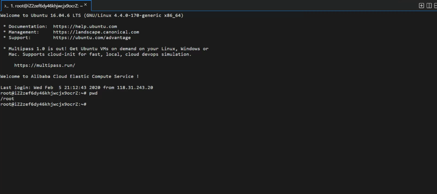

# 阿里云服务器从购买到网站部署

## 一、购买服务器

阿里云链接：[点击购买](https://www.aliyun.com/minisite/goods?userCode=2ebbhwss&share_source=copy_link)

打开之后可以通过账号注册或支付宝直接登录方式登录，然后点击购买，89/年这一款是最基础款，适用于跑一些自己开发的小型网站；229/年的是和上一款配置一样，不过多买比较便宜；799/三年这一款强烈推荐，因为前两款都是T5突发型服务器，有CPU性能限制，前两款都是20%的性能基线，而799这款是没有cpu限制的，可以跑100%，而且配置也比前两款高很多。

**ECS突发性能型t5**：这款是有cpu性能限制的，是20%的性能基线。这个是什么意思呢？

举个例子，你一开始拥有100积分 ，你的服务器的cpu平时占用20%和以下是没有影响的，但是每天你的cpu占用率超过20%，那就、会扣你的cpu积分；比如每超超过一小时，就扣你10积分，这样你顶多连续使用10小时，等你的cpu为0时，服务商会强制限制你的服务器cpu性能上限是20%；然后等你的服务器不用的时候，cpu占用率为0，那就会每小时涨10分， 最多涨到100分 。

这款基础款，对于绝大多数的个人开发者来说 是基本够用的——博客、跑Python爬虫脚本

**ECS共享型n4-3年：**不限制CPU性能，配置为2核4G3M带宽，配置比较好

这个阿里云服务器的优惠只限新用户，也就是说每个主体只能购买一次、享受一次这么大力度的优惠。如果以后还想用、跑一些消耗CPU的程序，并且钱包允许的话，建议买799/三年这一款。

## 二、提取服务器

购买后并不是直接到你控制台的，它是给你一张提货券，需要你去使用这张劵，开通相应版本的服务器。点击右上角的小铃铛(消息提醒)，然后点击进入'控制台-提货券'，点击使用


## 三、开通服务器

选择相应的配置，地域选择你所在的城市就好，操作系统选择你熟悉的，推荐使用Ubuntu 18 64位这个版本，其他默认，点击开通


## 四、初始化服务器

点击进入 管理控制台，点击实例，左上角地区选择刚才选择的区域，即可看到已经开通的服务器实例，点击管理进入管理页面


如果之前初始化的时候没有设置密码登录，可以在【更多】这里选择“重置实例密码”


然后点击【远程连接】，此时会打开一个新的浏览器标签页，输入账号和密码然后点击“确定”进行登录


现在准备安装宝塔面板程序

> 宝塔Linux面板是提升运维效率的服务器管理软件，支持一键LAMP/LNMP/集群/监控/网站/FTP/数据库/JAVA等100多项服务器管理功能。
> 有20个人的专业团队研发及维护，经过200多个版本的迭代，功能全，少出错且足够安全，已获得全球百万用户认可安装。运维要高效，装宝塔。
>
> 官网地址：https://www.bt.cn/

```shell
# Centos安装命令
yum install -y wget && wget -O install.sh http://download.bt.cn/install/install_6.0.sh && sh install.sh
```

```shell
# Ubuntu安装命令
wget -O install.sh http://download.bt.cn/install/install-ubuntu_6.0.sh && sudo bash install.sh
```


输入`y` 回车


安装之后会打印出宝塔面板登录的地址、账号、密码，这三条信息需要保存起来；为了让宝塔面板能够正常运行，还需要将防火墙端口（8888|888|80|443|20|21）打开，回到刚才的管理页面，点击安全组管理


在安全组规则页面点击“入方向”的“添加安全组规则”，将（8888|888|80|443|20|21）这几个端口打开


授权对象处填写`0.0.0.0/0`


开通之前在浏览器打开之前保存的宝塔面板的登录地址，勾选我同意，进入面板


第一次进入会提醒安装服务器的环境，配置环境按照下图来配置就好，安装需要一段时间的。


## 五、通过ssh远程服务器

连接工具有多种，此处推荐`FinalShell`工具，下载地址：[FinaShell](http://www.hostbuf.com/t/988.html)


打开之后点击一个文件夹的图标，选择SSH连接，输入公网ip、账号和密码就可以登录了


